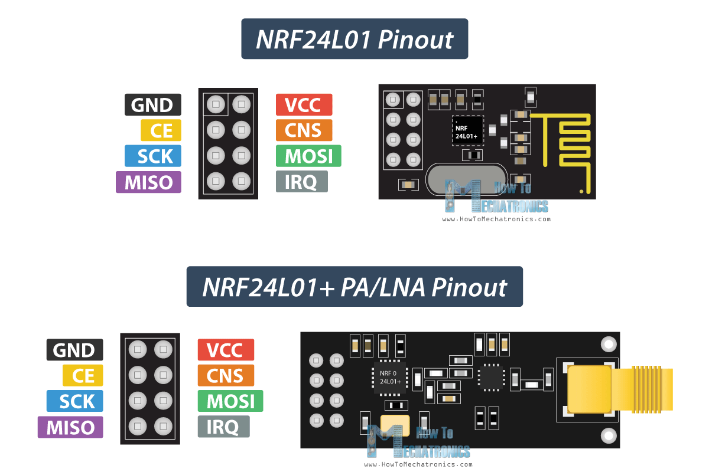

# LilyGo v1.0 POE

### Pinout

|         |        |
|---------|--------|
| GPIO39  | GPIO36 |
| GPIO35  | GPIO34 |  
| GPIO32  | GPIO16 | 
| GPIO12  | GPIO33 |
| GPIO15  | GPIO4  | 
| GPIO14  | GPIO2  | 
| GND     | 3V3    | 
| GND     | 3V3    | 

# Wiring

| NRF24l01 | LilyGo |
|----------|--------|
| GND      | GND    |
| 3V3      | 3V3    |
| CE       | GPIO14 |
| CS       | GPIO2  |
| SCK      | GPIO15 |
| MOSI     | GPIO4  |
| MISO     | GPIO12 |
| IRQ      | GPIO33 |

# NRF24l01

